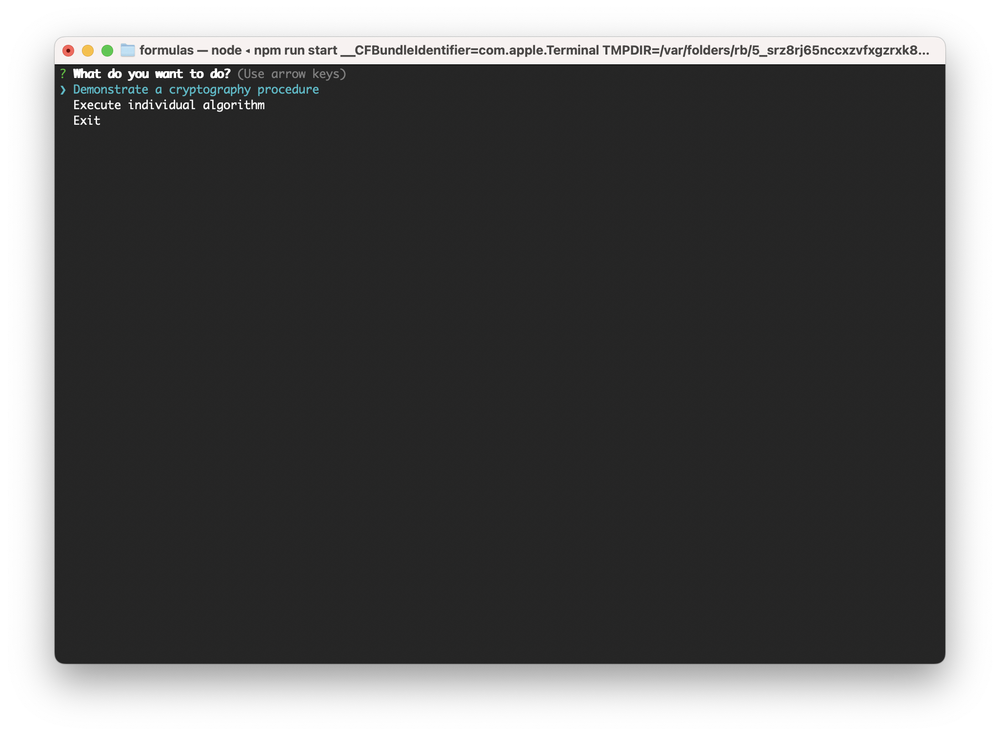
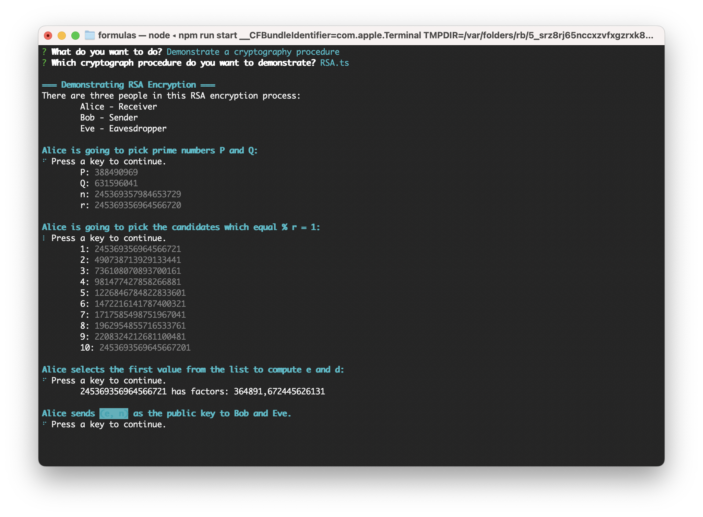
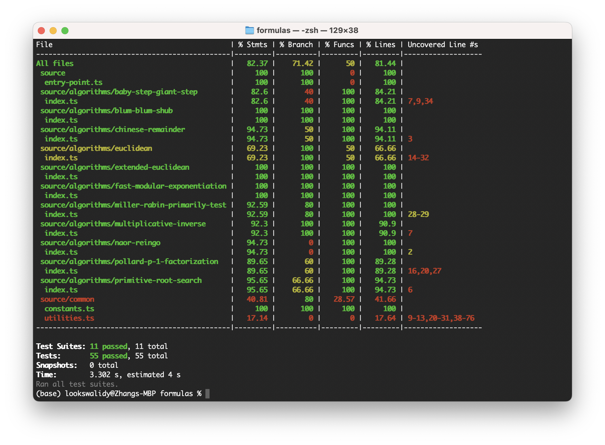
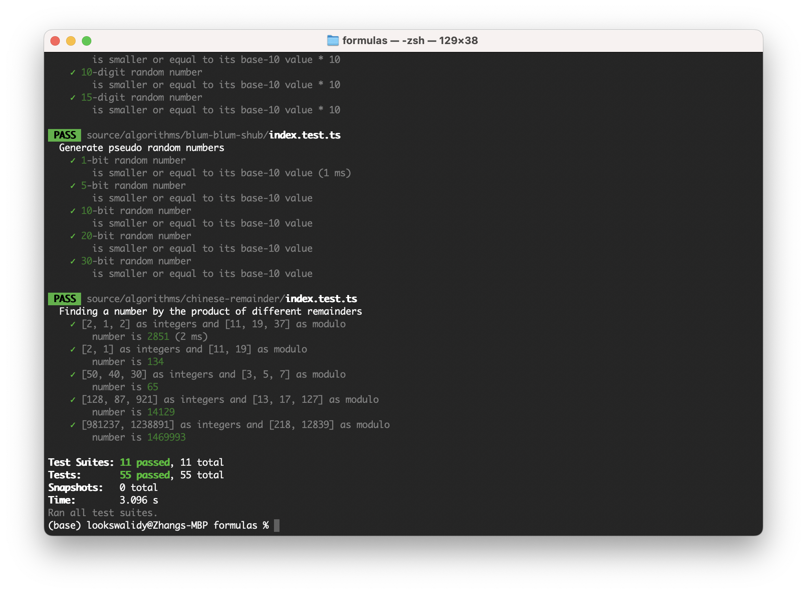

# Formulas

Provide a collection of formula functions and a command line tool. File structure:

```
├── images/
├── patches/
├── source/
│   ├── algorithms/
│   │   ├── baby-step-giant-step/
│   │   └── ...
│   ├── common/
│   │   ├── constants/
│   │   ├── utilities/
│   │   └── ...
│   ├── illustration/
│   │   ├── ElGamal.ts
│   │   └── ...
│   ├── types/
│   ├── command.ts
│   └── entry-point.ts
└── README.md
```

- [Formulas](#formulas)
  - [Origin](#origin)
  - [Prerequisites](#prerequisites)
  - [Instructions](#instructions)
    - [Start](#start)
    - [Test](#test)
      - [Issues](#issues)
  - [Algorithms](#algorithms)
  - [Encryption Flows](#encryption-flows)

## Origin

This package was originally a project for class **MET CS 789 Cryptography** at Boston University, instructed by **Geoffrey Pascoe**. Student Zhang, Jin Yu (siege@bu.edu / siegesailor@gmail.com) created this as a codebase to demonstrate the algorithms and encryption flows, and then found out it was pleasant to develop such a useful package.

## Prerequisites

See `engines` in [package.json](./package.json):

```json
"engines": {
    "node": ">= 16.0.0",
    "npm": ">= 8.0.0"
},
```

## Instructions

Use the following commands to help you to run or develop this project locally:

```bash
git clone https://github.com/SiegeSailor/formulas.git
```

Go to the folder you just created with `git clone`. It should be typically named `formulas`:

```bash
cd formulas
```

Install all the packages you need. Remember that you have to run this under `node >= 16.0.0` and `npm >= 8.0.0`. You can simply use `nvm use 16` if you have multiple versions on your local machine:

```bash
npm install
```

Then you are able to run the command-line tool with:

```bash
npm run start
```



### Start

This command-line tool allows you to either demonstrate encryption flow or execute algorithms with the inputs from you. Here is an example of RSA:



Executing Euclidean algorithm with your own inputs:


### Test

Formulas uses Jest for unit tests purpose. You can generate the coverage report:

```bash
npm run test -- --coverage
```



Or see the detail for each test case:

```bash
npm run test -- --verbose
```



#### Issues

Jest has an [issue](https://github.com/facebook/jest/issues/11617) working with the type `bigint` in multiple test files, which is widely used for algorithms in this project. In order to solve it, the property has been set in `jest.config.js`. Unfortunately, this setup will drag down some performance during testing:

```javascript
module.exports = {
    ...
    maxWorkers: 1,
};
```

## Algorithms

- [Baby Step Giant Step](./source/algorithms/baby-step-giant-step/)
- [Blum Blum Shub](./source//algorithms//blum-blum-shub/)
- [Chinese Remainder](./source/algorithms/chinese-remainder/)
- [Euclidean](./source/algorithms/euclidean/)
- [Extended Euclidean](./source/algorithms/extended-euclidean/)
- [Fast Modular Exponentiation](./source/algorithms/fast-modular-exponentiation/)
- [Miller Rabin Primarily Test](./source/algorithms/miller-rabin-primarily-test/)
- [Multiplicative Inverse](./source/algorithms/multiplicative-inverse/)
- [Naor Reingo](./source/algorithms/naor-reingo/)
- [Pollard P-1 Factorization](./source/algorithms/pollard-p-1-factorization/)
- [Primitive Root Search](./source/algorithms/primitive-root-search/)

## Encryption Flows

- [RSA](./source/illustration/RSA.ts)
- [ElGamal](./source/illustration/ElGamal.ts)
